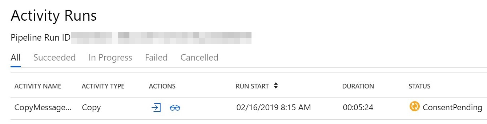

# 10 Tips for Using Microsoft Graph Data Connect

Microsoft Graph data connect is a new way to access the wealth of valuable data in your O365 tenant. This doc provides supplementary tips as you begin exploring data connect. It isn't intended to be an introduction to data connect, so if you're completely new to it, see the [data connect overview](https://docs.microsoft.com/en-us/graph/data-connect-concept-overview) and documentation first to get started.

## Know if data connect is right for you

Data connect and the Graph APIs provide access to the same underlying data but in very different ways. Data connect is designed to extract large amounts of data in bulk. The Graph APIs are much more suitable for accessing relatively small pieces of data in realtime. In some cases, it might even make sense to combine them. For example, you may want use data connect to do an initial "backfill" of the last 2 years of email data, and then use the Graph APIs to analyze emails in realtime moving forward. Data connect and the Graph APIs are different tools for different jobs, so it is important to think about which access method best fits your scenario.

## Expect an initial overhead

Since data connect is designed to extract large amounts of data in bulk, there's some overhead before the data can be copied. In my experience, the initial spin up time is around 30 minutes, meaning all pipelines will take at least that long regardless of the data size. This may be a negligible penalty for large amounts of data, but if the spin up time is unacceptable for your scenario, then the Graph APIs may provide a better approach.

## Data must stay within the same subscription

The data copy is orchestrated by Azure Data Factory, a data integration service that runs in an Azure subscription. The Azure subscription is [associated with exactly one O365 tenant](https://docs.microsoft.com/en-us/azure/active-directory/fundamentals/active-directory-how-subscriptions-associated-directory). This is the only tenant that data connect can extract data from! You can't specify an arbitrary tenant from which to fetch data. This way the data stays within the boundaries of the O365 tenant and associated Azure subscription.

If you want to build an app for others to use to extract _their_ O365 data, you can package the app as an [Azure Managed Application](https://docs.microsoft.com/en-us/azure/managed-applications/overview) and publish it to the Azure Marketplace. Then someone can install your app into their own Azure subscription, and the app can access data in their tenant. The data connect docs outline the process of [creating a Managed App that uses data connect](https://github.com/OfficeDev/MS-Graph-Data-Connect/wiki/Publish-an-Azure-Managed-Application-to-copy-Office-365-data).

## Use of service principals

When creating the Data Factory pipeline, you will have to provide a service principal to the O365 linked service. In Azure, a service principal is a security identity that represents an application/service (as opposed to a user). Data connect uses this service principal as its identity when getting authorized access to your O365 data.

If you create an Azure Managed Application for others to use in their tenants, you'll still provide a service principal for the app to use. This service principal will exist in your (the publisher's) tenant. However, if the app needs other service principals, your customer (the installer) will create them in their own tenant. For example, your Data Factory pipeline will likely need access to a storage resource in Azure. The customer would create the service principal with permissions to the storage account for the pipeline to use.

## Check for pending PAM requests

Before data connect can copy your data, an administrator has to approve a Privileged Access Management (PAM) request. PAM is the mechanism used to authorize your data pipeline access to the data in O365. The first time you trigger a pipeline, it will wait on an admin to approve the access request. Although the pipeline status shows "in progress"...

the underlying copy activity will have a status of "ConsentPending" until approval is granted.

During development it's a good idea to make sure your pipeline executions aren't stuck on `ConsentPending`, especially after you make a change to your pipeline. For example, if you add an additional field to the schema, the next pipeline run will issue a new PAM request that has to be approved. Don't waste time waiting on a pipeline that's waiting on you!

## Approve PAM requests via O365 admin portal

The data connect docs shows you how to use PowerShell to approve PAM requests, but you can also manage requests in the [O365 admin portal](https://admin.microsoft.com). The portal provides an easier and more user-friendly way to view and approve/deny PAM requests. You can find it under `Settings -> Security & privacy -> Privileged Access`

## Use a second user to approve PAM requests

When you execute a pipeline and trigger a PAM request, the request is attached to your user account. But even if this account is part of the approver group you set up, you can't use it to approve the PAM request because "self-approvals" are not allowed. If you try, you'll get an error message in the PAM portal:

> Requestor and approver are the same. Self approval is not allowed

So for development, you'll want to have a 2nd account in addition to the admin who approves requests.

## Parameterize pipelines using Data Factory

Data Factory allows you to add parameters to your pipeline so that each pipeline execution can be customized at runtime. In addition, data connect includes filters to extract only a subset of the data available. Combining pipeline parameters with data connect's filters enables you to parameterize your pipelines and choose which data to extract each time the pipeline runs.

For example, say you're copying email messages. You could use the filters of the dataset to only pull emails that were sent between 2 dates:

But instead of hardcoding the dates, you can parameterize them with dataset parameters, allowing you to re-use the same dataset for different date ranges. Notice that you can't insert separate expressions for the start and end times. You must construct a single expression for the entire query:

Then you can parameterize the entire pipeline and pass those pipeline parameters into the dataset:

Now you can run the same pipeline with different dates to extract different chunks of data.

You can also use parameters to make your output datasets more flexible and re-use the same Blob output dataset. Without parameters, your blob storage output dataset will point to a single container. But you may want to extract different O365 datasets into separate containers. Instead of creating an output dataset for each container, you can create a dataset parameter and use it in place of the container name:

Then each copy activity that outputs to that blob dataset can specify the name of the container to which it will output:

See the Data Factory docs to learn more about [parameters and expressions](https://docs.microsoft.com/en-us/azure/data-factory/control-flow-expression-language-functions).

## Deduplicate emails when needed

When extracting emails from the `Message` dataset, there will often be multiple JSON objects for the same email. These duplicates exist because when an email is sent to multiple people, there is a copy of the email in every recipient's mailbox. The dataset is extracted from every mailbox, so it will contain all copies. In some scenarios, it may be necessary to keep every copy. But in some analysis scenarios, you only want to count the email once, so you should deduplicate the emails after extraction.

You can deduplicate the exported JSON objects based on the `internetMessageId` of the messages: Two messages with the same `internetMessageId` are duplicate copies of the same instance. The duplicates can exist in different blobs, so you have to deduplicate across all blobs rather than deduplicating in each blob separately.

## Use puser field to determine the relevant user

In the extracted data, there are some meta properties that don't exist when using the corresponding Graph APIs. Specifically, the `puser` field can be useful for determining which user the data was extracted from. In the scenario above where you have 2 copies of the same email in different mailboxes, you could use the `puser` field to determine which copy came from which mailbox.

`puser` is also useful for datasets such as the `Manager` dataset. The exported JSON will contain information about a manager, but this is only useful if you know _whose_ manager they are. The `puser` field will tell you whose manager that JSON object corresponds to.